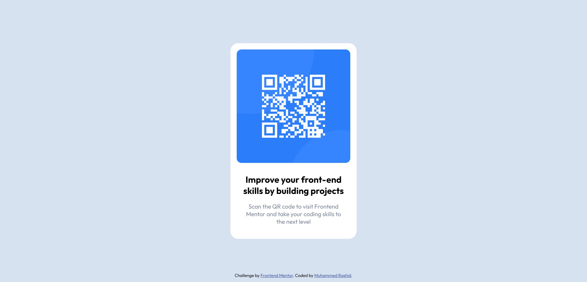

# Frontend Mentor - QR code component solution

This is a solution to the [QR code component challenge on Frontend Mentor](https://www.frontendmentor.io/challenges/qr-code-component-iux_sIO_H). Frontend Mentor challenges help you improve your coding skills by building realistic projects. 

## Table of contents

- [Overview](#overview)
  - [Screenshot](#screenshot)
  - [Links](#links)
- [My process](#my-process)
  - [Built with](#built-with)
  - [What I learned](#what-i-learned)
  - [Continued development](#continued-development)
  - [Useful resources](#useful-resources)
- [Author](#author)
- [Acknowledgments](#acknowledgments)

**Note: Delete this note and update the table of contents based on what sections you keep.**

## Overview

### Screenshot

### Links

- Solution URL: [Add solution URL here](https://github.com/MH-Rashid/qr-code-cmp)
- Live Site URL: [Add live site URL here](https://mh-rashid.github.io/qr-code-cmp/)

## My process

### Built with

- Semantic HTML5 markup
- CSS custom properties
- Flexbox
- Mobile-first workflow

### What I learned

- How to center an object vertically on the page (various ways)
- Clean ways of constructing a footer that stays on the bottom of the page

### Continued development

- Using flexbox and CSS grid in more creative ways, e.g. to centre content on the page, not just inside objects.
- Thinking outside the box to come up with efficient and effective solutions to coding problems
- Writing concise, clean CSS